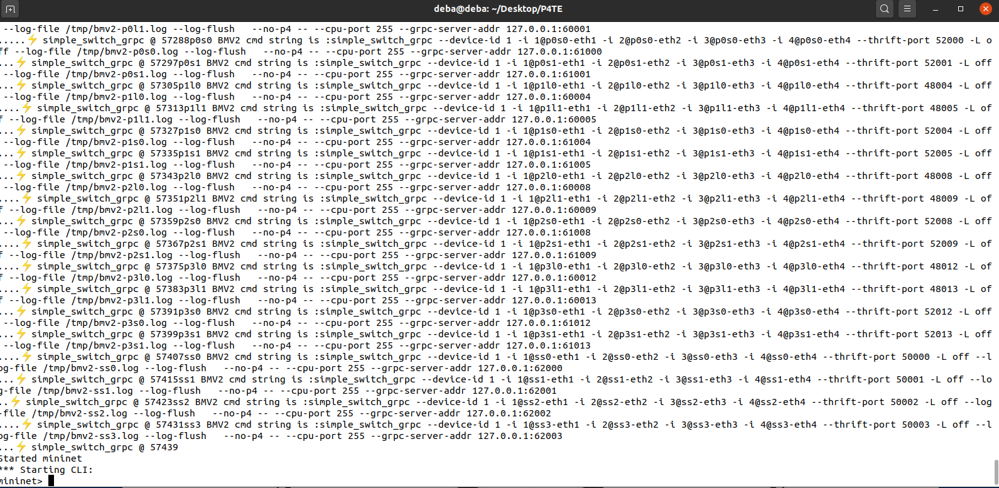
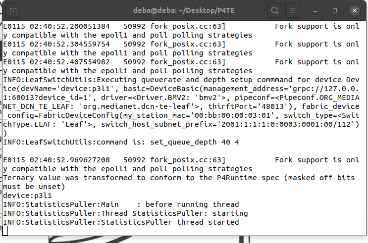

# How to setup the environment
    . Go to jfingerhut's github repository of P4-guide. 
    . Use the install script you want to use appropriate for your distribution.

# Now download the github repository for this project 

# All the necessary libraries should be already installed in the system by now

# How this system works (Main configuration file for this project is "./ConfigConst.py" (All the file and folder path described in this doc are relative to the project directory)
    
# Configuring and running the Mininet based topology
    1) This system at first starts a fat-tree topology using mininet. 
    2) All the switches are bmv2 P4 software switch. So in the environemnt setup stage all the dependency should be installed in your machine
    3) Fat-tree topology needs to provide the maximum number of ports in a switch. And P4TE assumes that , there will be a common IP prefix for the whole DCN
    4) You need to configure 3 information in the file "MininetSimulator/ClosConstants.py"
        a) CLOS_MAX_PORT_NUMBER = 4 -- Here 4 is the maximum number of ports in the switches. You can use any even number for your network 4,8,16 etc
        b) DCN_CORE_IPv6_PREFIX = "2001:1:1:1:0:" -- Here the IPv6 prefix for the DCN is "2001:1:1:1:0:" you can use your own Ipv6 prefix. The system will allocate IPv^ addresses for the hists and switches it's ownself
        c) lastly you need to allocate IPv6 ports range for various use of the system 
            LEAF_SWITCH_GRPC_PORT_START = 60000 # 50000+i
            SPINE_SWITCH_GRPC_PORT_START = 61000 # 50500+i
            SUPER_SPINE_SWITCH_GRPC_PORT_START = 62000 # 50500+i
            CPU_PORT = 255 # we hope that we will never use 256 port of a device
            
            
            LEAF_SWITCH_THRIFT_PORT_START = 48000 # 50000+i
            SPINE_SWITCH_THRIFT_PORT_START = 52000 # 50500+i
            SUPER_SPINE_SWITCH_THRIFT_PORT_START = 50000 # 50500+i
            
            Each switch needs grpc and thrift port for various control plane communication. So in your machine either these mentioned port range should be free.
            Or you  have to allocate port range acoording to your machine

# Running the Mininet Topology 
    1) after you have completed your desired configuration for the mininet emulator part, now it's time to run the emulator
    2) open a terminal and change the directory to project folder
    3) The folder contains a MAkefile 
    4) Just run the command "make start_clos" -- this command will start the clos (fat-tree topology)
    5) If everything is okay you should see an output like folllowing and that means the simulator have started. 
       

# Intermediate Information 
    1) Once the mininet simulator have started, all the informations regarding the topology is writtem to an intermediate file and it is used 
        frequently in various places. This is defined as "MininetSimulator/Build/Internalnetcfg.json". Do not change it

# Running the control plane:
## You need to configure few paths and parameters for successfully running this project (All the file and folder path described in this doc are relative to the project directory))
    1)  Open the file "ConfigConst.py". This file contains various comments about the parameters. The comments are self descriptive. We wil mention only the necessary parameters 
    2) say about link capacity config
    3) say about link capacity to buffer config
    4) For link utilization rate monitoring P4 meters are used. Rate settings for these meters are following 
        EGRESS_STATS_METER_CIR_THRESHOLD_FACTOR = 0.70  # This means each port will color packet yellow when it reaches 70% of the queu rate and red when
        EGRESS_STATS_METER_CBURST_FACTOR = 0.1
        EGRESS_STATS_METER_PIR_FACTOR = 0.9
        EGRESS_STATS_METER_PBURST_FACTOR = 0.1
        You can change the values according to your necessity
    5) To configure How much of the link capacity should a traffic class get you have to configure follwoing parameters
        PERCENTAGE_OF_TOTAL_UPWARD_TRAFFIC_FOR_TRAFFIC_CLASS = [30,20, 5] #
        In our example system we used 2:1 over subscriptioon ration with 2 traffic classes. so uoward link capacities are half of incoming link capacity. 
        there for 30 percent of the incoming link  implies to 60 % capacity of the upward links. simislarly 20 impleies to 40. 
        Though in the example there are 3 number, they are supposed for 3 traffi classes. Our system can be configured for n traffi classes.
        But at this moment we are working only with 2 traffic classes, so ignore 3 rd number. 
    6) Next, for both hop-by-hop delay and egres queue depth we have used 3 levels only (look at our paper P4TE)
        PORT_TO_PORT_DELAY_LEVELS_LINEAR = [(0, 1000, 0, 0),(1001,5000,1,0), (5001, 75000,2,00)]
        --this means if hop-by-hop delay for a port falls in range 0-1000 it will be in routing group of level 1, if 1001-5000 it will be in level 2 and so on
        EGRESS_QUEUE_DEPTH_DELAY_LEVELS_LINEAR = [(0, 2, 0, 0),(3,5,1,0), (6, 10,2,00)]
        -- similarly this is also for levels of egress queue deptth. If in your system you want different values for corresposding level you can change them

    7) We used 50KB flow size for short flow and 256 KB for large flows
        FLOW_TYPE_IDENTIFIER_BY_FLOW_VOLUME_IN_KB = [50, 256]  # These means in our experiments we will consider 2 types of traffic . one with 50 KB size another 1 MB or 1024 KB
        If you want to test with different values change them 

# P4 source related configurations is in "p4src/src/CONSTANTS.p4"
    1) for use of Delta in egress qeueu depth monitoring we used the follwoing parameter
        const bit<19> EGRESS_QUEUE_DEPTH_THRESHOLD = 4;
    2) For ECN threshold for ECMP algorithm you can configure the follwoing parameter based on your system  
            const bit<19> ECN_THRESHOLD = 2;
    3) P4TE uses a threhodl for how many bytes a flow should not face rate control. That parameter is follwoing
        const bit<32> SEQ_NUMBER_THRESHOLD_FOR_RATE_CONTROL = 5000; // this means for each 5000 byte we will check for rate control. 
    4) Factors by how much a flows window size should be increased or decreased are configured by the follwoing 2 parameters
        const bit<8> WINDOW_DECREASE_RATIO = 2;  // this is used when there is some congestion how mnay times ^ -1 a windows will be reduced. 2 means 2 times shift. or window size half.
        const bit<8> WINDOW_INCREASE_RATIO = 8;

# Compiling P4 programs
    1) Makefile contains 2 rules for ecmmp and P4TE algorithm 
        a) for ecmp you can invoke "p4-ecmp"
        b) for P4TE, invoke "p4-leaf-cp-assisted-multicriteria-policy-routing-with-rate-control"

# After you have started the mininet based topology,  compiled the P4 programm, configured all the parameters, It's now time to run the control plane

    1) At this moment our system supports 2 control plane algorithms a) ECMP and b) the algorithm desbribed in our P4TE paper. 
    2) If you want to run the 
        a) ECMP algorithm then in the config file write ---- 
        b) P4TE algorithm then in the config file write 
    3) then open anothter terminal and change the directory to project directory and invoke follwoing command 
        make start_ctrlr
        --wait and if everything is okay you should see follwoing output
        When you see the line "INFO:StatisticsPuller:StatisticsPuller thread starte" -- then you can assume the system have started sucessfullly

# Lastly if you wan to tun some flows, we have an IPerf based systems
    -- The basic idea is -- in a json file you give the configuration of a flow . T
    -- Then you run a python script with passing the file as parameter. This python script will start corresponding flows to the mininent emulated hosts
    Configurations you need to provide 
        1)  This project uses IPerf tool for testing performance. IPerf results are saved in json format. You have to provide the location where all the outout of the IPErf tests will be saved
            In the "ConfigConst.py" file provide the path in follwoing variable 
                TEST_RESULT_FOLDER = "/home/deba/Desktop/P4TE/testAndMeasurement/TEST_RESULTS"
        a) There are some sample test configurations provided in directory "testAndMeasurement/TestConfigs"
            Assume you want to "testAndMeasurement/TestConfigs/MyTest.json" 
        then open a terminal and move to the project directory and run the follwoing command 
            python3 TestCaseDeployer.py testAndMeasurement/TestConfigs/MyTest.json
        There is no automatic way to tell that a flow have been completed. you have to do some testing your own self to understand when a flow have stopped.
        Yo ucan easily guess that from the IperfOutput files.
        ---- All the IPerf results used in our P4TE papers are inside folder ""/home/deba/Desktop/P4TE/testAndMeasurement/TEST_RESULTS"
        

# Test configurations and results used in our paper are following. For each of the follwing scenarios we have tested both under 
ECMP and P4TE. The configuration for both the cases are same. only results are saved in different folders to compare the results

    1) Stride pattern low load:
        a) config  file: testAndMeasurement/TestConfigs/ecmp/l2strideSmallLarge-16k-sc8.json and testAndMeasurement/TestConfigs/P4TE/l2strideSmallLarge-16k-sc8.json
        b) To use this test configuration make the "STRIDE_COUNT = 8" in ConfigCost.py
    2) Stride pattern high load:
        a) config  file: testAndMeasurement/TestConfigs/ecmp/l2strideSmallLarge-16k-sc16.json and testAndMeasurement/TestConfigs/P4TE/l2strideSmallLarge-16k-sc16.json
        b) To use this test configuration make the "STRIDE_COUNT = 16" in ConfigCost.py
    3) TCP incast: 
        a) config file: testAndMeasurement/TestConfigs/ecmp/l2-incast.json and testAndMeasurement/TestConfigs/P4TE/l2-incast.json
    4) TCP congestion: 
        a) config file: testAndMeasurement/TestConfigs/ecmp/l2-congestion.json and testAndMeasurement/TestConfigs/P4TE/l2-congestion.json
    5) Link Utilization Test: 
        a) config file: testAndMeasurement/TestConfigs/ecmp/linkUtilizationTester.json and testAndMeasurement/TestConfigs/P4TE/linkUtilizationTester.json
 

## Finally results from  these test cases are processed and  relevant grpahs can be accessed from folder "ProcessedResultImages"
    This folder also contains a summary result of the test cases in file "Resultsummary.md"

## The Makefile contains commands to run the program for processing the test case results. 

    